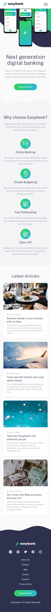

# frontend-mentor easybank challenge

This is my take on FrontendMentor's Easybank challenge. I've tweaked the
design a little bit. Mainly added some waves. They make the design pop. Which
I think looks quite nice.

## How to run the website

Make sure you have npm installed. You can [download Node.js and Npm from here](https://nodejs.org/en/download/).

After installing npm, run `npm install` to get all the packages required then
run `npm start` to start the development server. You can then view the website on
[http://localhost:1234](http://localhost:1234).

You can also [view the site live here](https://asadmoosvi-easybank.netlify.app/).

## Screenshots

### Desktop

### Mobile

